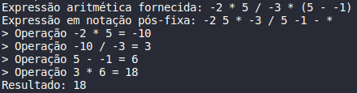
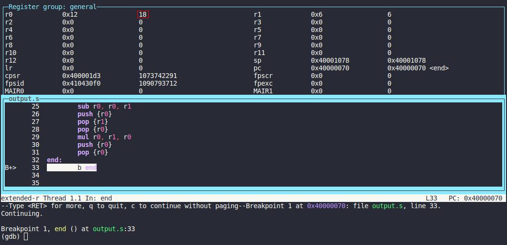

# Documentação do Projeto JEMAPELI - Compilador de Expressões Aritméticas

## 1. Introdução

A compilação é um dos processos mais importantes na computação, ela permite que programadores e processadores evoluam de forma mais ou menos independente ao permitir que cada um trabalhe com o seu domínio léxico de maior eficiência.

Enquanto os programadores desenvolvem código numa escrita próxima à da linguagem natural, a máquina utiliza a linguagem de montagem. A primeira permite ao programador pensar de forma mais natural, já que é próxima ao mundo em que ele vive, já a segunda, permite à máquina separar cada instrução, podendo dar o tratamento correto a elas.

Nesse sentido, os compiladores fazem a tradução de uma linguagem para a outra, sendo o elo que mantém os dois lados em conexão. Pois, enquanto mantém-se a eficiência e a semântica de cada modelo, permitem transitar entre cada forma facilmente e desenvolver cada um de maneira independente.

Para o presente trabalho implementa-se um tipo de compilador, a saber, um compilador de expressões aritméticas. Esse compilador, tem como objetivo, traduzir uma expressão aritmética de números inteiros para a linguagem de montagem ARMv7 correspondente. A seguir, detalha-se a solução proposta, nossas decisões de projeto, como se dá a execução da compilação e, por fim, um exemplo de execução.

## 2. Solução

O compilador desenvolvido utiliza a linguagem C para implementar suas funcionalidades. Recebe como entrada um arquivo texto `input.txt` contendo uma expressão aritmética com números inteiros, parênteses e operadores aritméticos (“+”, “-“, “\*”, “/“), sendo que os números e operadores são separados por um caractere de espaço em branco (“ “). Um exemplo de operação válida é: “2 + 3 \* (-4) - 5”. Por fim, como saída o compilador gera um arquivo de saída `output.s` contendo o código asm em ARMv7 correspondente à expressão aritmética original.

Entrando em um pouco mais de detalhes, o compilador começa a execução abrindo o arquivo `input.txt` que contém a expressão aritmética a ser compilada. O passo seguinte é transformar a expressão aritmética numa expressão em notação polonesa reversa ou pós-fixa. Uma expressão em notação polonesa reversa é uma forma de representação de uma expressão que leva em consideração a precedência entre as operações e a ordem em que elas são executadas, considerando a leitura da expressão da esquerda para a direita. Por exemplo, a expressão válida do exemplo anterior, ao ser transformada para sua equivalente polonesa, ficaria: “3 (-4) \* 5 - 2 +”. Vale notar que esse tipo de expressão se utiliza de uma pilha para guardar os dados, empilhando quando o dado for lido e desempilhando quando for usado.

Após a transformação da expressão dada numa expressão em notação polonesa reversa, gera-se o código em ARMv7 para cada uma das operações da pilha de operadores. Por exemplo, desempilhar o valor 3 da pilha pode ser representado como uma instrução de “mov r0, #3” em ARMv7, ou como outro exemplo, a operação de dois valores desempilhados com o respectivo operando desempilhado, “mul r0, #3, #-4”. A essas operações são somadas outras como loads, stores e tratamento do stack pointer. Cada instrução traduzida é imprimida diretamente no arquivo `output.txt`, que contém o código _assembly_ final.

Desse modo, ao completar o processo de conversão da expressão em notação polonesa para o código de montagem impresso no arquivo de saída, fecha-se esse e termina-se a execução do compilador.

Para a compilação do código desenvolvido é usado o compilador da linguagem C gcc. Além disso, faz-se uso de um `Makefile` para automatizar os comandos utilizados na compilação e na execução do projeto. Existem comandos para: limpar todos arquivos (`make clean`); gerar o executável do compilador, e com isso, executar o processo de compilação da expressão aritmética dada em `input.txt`, e, por fim, montar o código assembly ARMv7 no arquivo `output.s` e vinculá-lo ao arquivo `kernel.ld` (`make`); executar o emulador QEMU (make qemu); e executar o depurador GDB com a expressão aritmética compilada (`make gdb`).

## 3. Passo a passo de execução

Para a execução do compilador são necessários os seguintes passos em sequência:

1. Insira no arquivo `input.txt` a expressão aritmética de operandos inteiros com parênteses **'('** e **')'** e com os operadores **'+'**, **'-'**, **'\*'** e **'/'**, mantendo os operandos separados dos operadores por espaços **' '**.

2. A seguir, para compilar o código do compilador `compiler.c`, executá-lo e, assim, gerar o código _assembly_ ARMv7 correspondente à expressão aritmética fornecida no arquivo `output.s`, execute o seguinte comando no terminal:

```
make
```

4. Após isso, inicie o emulador QEMU através do comando:

```
make qemu
```

5. Por fim, para executar o código _assembly_ ARMv7 gerado no depurador GDB, execute:

```
make gdb
```

O resultado da expressão aritmética calculada pelo código _assembly_ ARMv7 está no registrador **r0**.

## 4. Exemplo de execução

A fim de ilustrar o funcionamento do compilador, apresenta-se em seguida um exemplo de sua execução do início ao fim.

Em primeiro lugar, insere-se a seguinte expresão aritmética no arquivo de entrada `input.txt`:

```
-2 * 5 / -3 * (5 - -1)
```

A partir disso, executando-se o programa em `compiler.c`, é gerado no arquivo de saída `output.s` o seguinte código _assembly_ correspondente à expressão aritmética fornecida:

```
.text
.global main
main:
	ldr sp, =inicio_stack
	mov r0, #-2
	push {r0}
	mov r0, #5
	push {r0}
	pop {r1}
	pop {r0}
	mul r0, r1, r0
	push {r0}
	mov r0, #-3
	push {r0}
	pop {r1}
	pop {r0}
	sdiv r0, r0, r1
	push {r0}
	mov r0, #5
	push {r0}
	mov r0, #-1
	push {r0}
	pop {r1}
	pop {r0}
	sub r0, r0, r1
	push {r0}
	pop {r1}
	pop {r0}
	mul r0, r1, r0
	push {r0}
	pop {r0}
end:
	b end
```

Além disso, imprimem-se a expressão aritmética inserida, a expressão convertida para notação pós-fixa, a sequência de operações interias realizadas e o resultado final:



Finalmente, executando o código acima no QEMU e utilizando o depurador GDB, obtém-se o seguinte resultado para a expressão escolhida no registrador r0:


